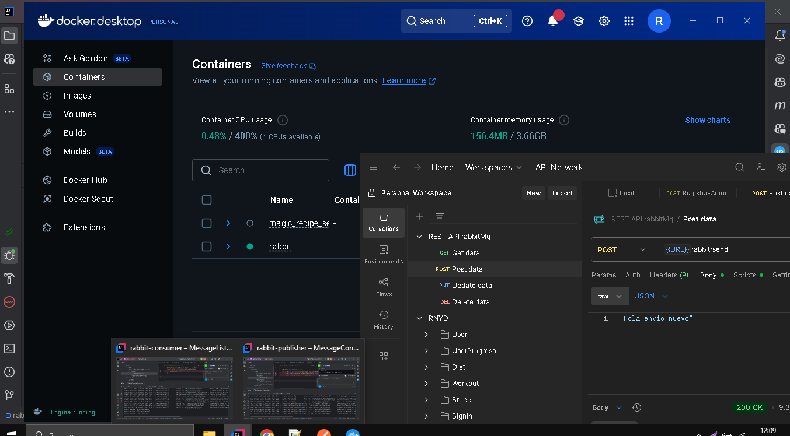

Pasos:
1- Abrimos el Desktop Docker
2- Intell Ij Terminal rabbit-consumer o publisher
docker run -d --hostname rabbitmq --name rabbitmq -p 5672:5672 -p 15672:15672 rabbitmq:management
3- Accedemos una vez arrancado el docker a RabbitMQ
http://localhost:15672/#/queues

4- Arrancamos los dos proyectos
rabbit-consumer
rabbit-publisher

5- lanzamos el postman y hacemos una peticion post
http://localhost:8080/rabbit/send
{   
"message": "Hola mundo"
}

